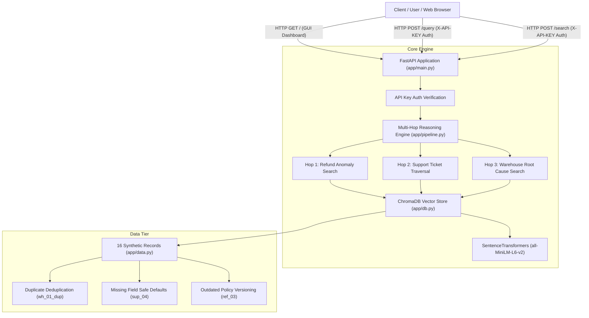

# NovaCart Enterprise AI Assistant — Architecture Specification

This document details the system architecture, component interactions, and data flow for the **NovaCart Enterprise AI Assistant** (Horrazon AI Engineering Challenge), designed strictly under the **Ponytail minimalist philosophy**.

---

## 🏗️ High-Level System Architecture



---

## 🔄 Component Sequence & Multi-Hop Data Flow

```text
 [ Client Query ] -> "Why did refunds increase in March?"
       │
       ▼
 [ FastAPI Gateway ] ── (Verify Header: X-API-KEY: novacart-secret-key)
       │
       ▼
 [ Multi-Hop Pipeline ]
       │
       ├─► Hop 1: Retrieve Refund Records (where={"doc_type": "refund"})
       │          └─► Discovers refunds for Earbuds Pro (ref_01) and POS Terminals (ref_02).
       │
       ├─► Hop 2: Retrieve Support Tickets (where={"doc_type": "support_ticket"})
       │          └─► Discovers 45 water ingress tickets (sup_01) and transit damage (sup_02).
       │
       └─► Hop 3: Retrieve Warehouse Logs (where={"doc_type": "warehouse_log"})
                  └─► Pinpoints Forklift Humidity Seal damage (wh_01) and Conveyor Jam (wh_02).
       │
       ▼
 [ Evidence Synthesis Engine ]
       │
       ▼
 [ Structured API Response ]
       ├─► Synthesized Answer string
       ├─► Confidence Score ("High (95%)")
       └─► 6 Verified Evidence Source Cards
```

---

## 📊 Technical Stack Specs

- **Web Framework**: FastAPI `0.110+` running on Uvicorn `0.28+`
- **Embedding Model**: `sentence-transformers/all-MiniLM-L6-v2` (384-dimensional dense vectors)
- **Vector DB**: ChromaDB `0.4.24+` with native HNSW Cosine Distance indexing (`hnsw:space: cosine`)
- **Authentication**: Native FastAPI Security Dependency (`X-API-KEY`)
- **Testing**: Pytest `8.0+` with FastAPI `TestClient`
- **Container**: Slim Python 3.12 Linux base image (`python:3.12-slim`)
